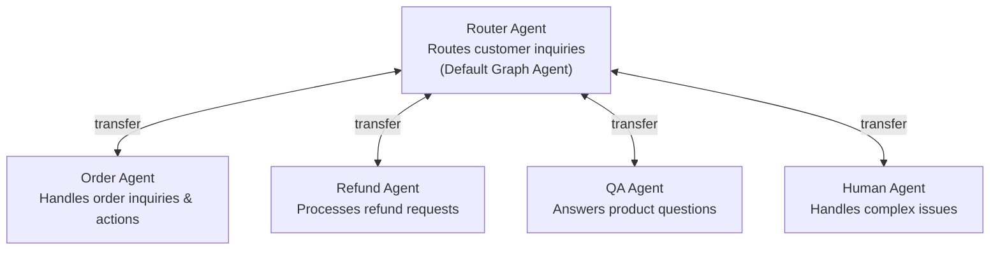

Inkeep's multi-agent framework enables multiple specialized AI agents to collaborate and solve complex problems through a **graph-based architecture**. You can define networks of agents, each with unique prompt, tools, and purposes.

## Two ways to build your agents

1. **Visual Builder**: A no-code interface for designing and managing agent workflows, making complex agent systems accessible to non-technical teams.


2. **Typescript SDK**: A code-first approach for building and managing agent workflows, allowing you to build complex agent systems with full control over the code.

   ```javascript
    import { agent, agentGraph } from '@inkeep/agents-sdk';

    const helloAgent = agent({
      id: 'hello-agent',
      name: 'Hello Agent',
      description: 'A basic agent',
      prompt:
        'You are a basic agent that just says hello. You only reply with the word "hello", but you may do it in different variations like h3110, h3110w0rld, h3110w0rld! etc...',
    });

    export const graph = agentGraph({
      id: 'basic-graph',
      name: 'Basic Graph Example',
      description: 'A basic graph',
      defaultAgent: helloAgent,
      agents: () => [helloAgent],
    });
   ```

## Key Features

- **Agents**: Decision-making units defined by prompts and prompt that call tools and coordinate across multiple agents.
- **Tools**: The capabilities that agents can invoke. Tools can be your own custom functions or you can leverage our pre-built MCP tools for common integrations.
- **Visual Builder**: A no-code interface for designing and managing agent workflows, making complex agent systems accessible to non-technical teams.
- **Sub-agents**: Specialized components within our multi-agent architecture that enable direct user communication through delegation and transfers. Transfers reduce latency by avoiding a central agent proxy.
- **Comprehensive Tracing**: Gain full visibility into every step of your agent workflows.

## Advanced Features

- **Data components**: UI elements agents can render in conversations (order lists, buttons, forms, etc.).
- **Context Fetchers**: A mechanism for dynamically retrieving and caching external data when agents need it.
- **Artifacts**: The structured information generated by an agent's or tool's work.

## License

The Inkeep Agent Framework is licensed under the **Elastic License 2.0** ([ELv2](https://www.elastic.co/licensing/elastic-license)) subject to **Inkeep's Supplemental Terms** ([SUPPLEMENTAL_TERMS.md](https://github.com/inkeep/agents/blob/main/SUPPLEMENTAL_TERMS.md)). This is a source-available license that allows broad usage while protecting against certain competitive uses.

## Prerequisites

[Install Docker Desktop](https://www.docker.com/)

### Clone this repo

- [Install GitHub Desktop](https://docs.github.com/en/desktop/installing-and-authenticating-to-github-desktop/installing-github-desktop)

## Getting Started

Create environment variables in a new file at `agents-manage-api/.env`, `agents-run-api/.env`, `agents-manage-ui/.env`, and `packages/agents-core/.env`:

Example `agents-manage-api/.env.example`:
```
ENVIRONMENT=development
DB_FILE_NAME=file:local.db
ANTHROPIC_API_KEY=
```

Example `agents-run-ui/.env.example`:
```
ENVIRONMENT=development
DB_FILE_NAME=file:local.db
ANTHROPIC_API_KEY=
```

Example `packages/agents-core/.env.example`:
```
DB_FILE_NAME=file:../../local.db
```

All `DB_FILE_NAME` should point to the same sqlite file.  

### Installation

Install the dependencies:
```bash 
pnpm install
```

### Database Setup

Set the DB schema:

```bash
cd packages/agent-core
pnpm db:push
```

### Running the Development Server

Runs the server and local MCP server:

```bash
pnpm dev
```

### Examine the OpenAPI specification for the server:

```bash
browser open http://localhost:3002/docs
```

### Running the test suite

```bash
pnpm test
```

This will run the test suite in parallel and create in-memory databases for each test to create isolation.

### Testing with Sample Graph

Execute the sample graph build/test. Observe the output. Use the sample graph defintion as a basis for your own graph defintion:

```bash
cd inkeep-chat
pnpm exec tsx examples/graph.graph.ts
```

## Credential Management

The Agent Framework provides a flexible credential store system to securely manage API keys, OAuth tokens, and other sensitive configuration. The system supports multiple credential store implementations and integrates with external credential management services.

### Credential Store Architecture

The framework uses a pluggable credential store architecture with multiple implementations:

1. **`InMemoryCredentialStore`** - Environment variable loading and runtime credentials
2. **`NangoCredentialStore`** - OAuth and API key management via Nango
3. **Custom implementations** - Extend the `CredentialStore` interface

### Core Components

#### CredentialStore Interface

All credential stores implement the `CredentialStore` interface:

```typescript
interface CredentialStore {
    id: string;
    get(key: string): Promise<string | undefined>;
    set(key: string, value: string): Promise<void>;
    delete(key: string): Promise<boolean>;
    list(): Promise<string[]>;
}
```

#### Database Storage

Credential configurations are tracked in the database via the `credentialStores` table, with tools directly referencing credential stores:

```typescript
// Credential store record
credentialStores: {
  id: "cred_123",
  tenantId: "tenant_456", 
  referenceId: "slack_oauth_connection", // External reference (e.g., Nango connectionId)
  type: "nango", // Store implementation type
  credentialStoreId: "slack", // Maps to framework.getCredentialStore(id)
  retrievalParams: { // Provider-specific configuration
    connectionId: "conn_abc123",
    providerConfigKey: "slack",
    provider: "slack",
    authMode: "OAUTH2"
  }
}

// Tool record with direct credential reference
tools: {
  id: "slack_mcp_server",
  tenantId: "tenant_456",
  name: "Slack MCP Server",
  credentialReferenceId: "cred_123", // Direct reference to credentialStores.id
  config: {
    type: "mcp",
    mcp: {
      server: { url: "https://api.nango.dev/mcp" },
      transport: { type: "streamable_http" }
    }
  }
}
```

### InMemoryCredentialStore

The `InMemoryCredentialStore` automatically loads environment variables prefixed with `CREDENTIAL_STORE_` on initialization.

#### How it works

1. **Runtime Override**: Supports adding or modifying credentials at runtime
2. **Fetch Environment variables**: Supports fetching credentials from environment variables by variable name.

#### Setting up credentials

```bash
# Set environment variables
export OPENAI_API_KEY="sk-proj-abc123..."
export ANTHROPIC_KEY="sk-ant-xyz789..."
```

#### Direct Usage

```typescript
import { AgentFramework, InMemoryCredentialStore } from './inkeep-chat/src/framework/index.js';

// Create framework - automatically loads CREDENTIAL_STORE_* env vars
const framework = new AgentFramework({
    credentialStores: [
        new InMemoryCredentialStore('default'), // Loads env vars automatically
    ],
});

// Access loaded credentials from the environment
const store = framework.getCredentialStore('default');
const openaiKey = await store?.get('OPENAI_API_KEY'); // 'sk-proj-abc123...'
const anthropicKey = await store?.get('ANTHROPIC_KEY'); // 'sk-ant-xyz789...'

// Add runtime credentials
await store?.set('DYNAMIC_TOKEN', 'runtime-generated-token');
```

#### Builder SDK Usage

```typescript
const inkeepApiKeyCredential = await createCredentialReference({
    tenantId,
    data: {
        id: 'openai-api-credential',
        type: 'memory',
        credentialStoreId: 'default',
        retrievalParams: {
            key: 'OPENAI_API_KEY'
        }
    } as any,
});
```

### NangoCredentialStore

The `NangoCredentialStore` integrates with [Nango](https://nango.dev) to manage OAuth flows and API key credentials for third-party services.

#### Features

- **OAuth 2.0 Integration**: Automated OAuth flows for popular services (Slack, GitHub, Zendesk, etc.)
- **API Key Management**: Secure storage of API keys and bearer tokens
- **Multi-tenant Support**: Isolated credentials per tenant and connection
- **Webhook Integration**: Automatic credential updates via Nango webhooks
- **Token Refresh**: Automatic OAuth token refresh handling

#### Setup

```typescript
import { NangoCredentialStore } from './inkeep-chat/src/credential-stores/nango-store.js';

const framework = new AgentFramework({
    credentialStores: [
        new InMemoryCredentialStore('default'), // For environment variables
        new NangoCredentialStore('nango'), // For OAuth and API keys
    ],
});
```

#### Configuration

Set up Nango integration with environment variables:

```bash
# Nango API configuration
export NANGO_SECRET_KEY="nango_sk_..."
export NANGO_HOST="https://api.nango.dev" # Optional, defaults to Nango cloud
```

#### OAuth Flow Integration

The NangoCredentialStore integrates with the frontend OAuth flow:

1. **Frontend initiates OAuth**: User selects provider (Slack, GitHub, etc.)
2. **Nango handles OAuth**: Redirects to provider and captures tokens
3. **Webhook notification**: Nango notifies your server of successful connection
4. **Automatic storage**: Credentials are automatically saved to the credential store

#### Usage with Agents

```typescript
// Retrieve OAuth tokens for MCP server authentication
const nangoStore = framework.getCredentialStore('nango');
const slackToken = await nangoStore?.get('slack_oauth_connection');

// Use in MCP server configuration
const slackMcpServer = {
    url: 'https://api.nango.dev/mcp',
    auth: {
        type: 'bearer',
        token: slackToken
    }
};
```

### Credential Stuffer

The **Credential Stuffer** is a component responsible for injecting the appropriate credentials into MCP server requests and context fetch requests at runtime. It bridges the gap between stored credentials and active tool usage.

#### How it works

1. **Tool-Credential Assignment**: When a tool is created, a credential reference is stored directly on the tool record
2. **Runtime Injection**: During tool execution, the Credential Stuffer:
   - Looks up the credential reference directly from the tool configuration
   - Retrieves the actual credential from the appropriate credential store
   - Injects the credential into the MCP server request
3. **Security**: Credentials are never stored in tool configurations, only injected at runtime

#### Architecture

```typescript
credentialReference: {
  id: 'slack-api-credential',
  type: 'memory',
  credentialStoreId: 'memory-default',
  retrievalParams: {
      key: "SLACK_API_KEY"
  }
};

// Tool-Credential relationship
tools: {
  id: "slack_mcp_server",
  name: "Slack MCP Server", 
  credentialReferenceId: "slack_oauth_connection", // Points to credentialStores table
  config: { type: 'mcp', mcp: { server: { url: '...' } } }
}

// Agent-Tool relationship
agentToolRelations: {
  agentId: "sales_agent",
  toolId: "slack_mcp_server" // Simple many-to-many relationship
}

// At runtime, Credential Stuffer:
// 1. Gets tool record with credentialReferenceId
// 2. Finds credentialReferences record by credentialReferenceId
// 3. Determines credential store type from the type column (nango, inmemory, etc.)
// 4. Retrieves credential from the store reference by credentialStoreId
// 5. Injects into MCP request headers/auth
```

#### Example Implementation

```typescript
class CredentialStuffer {
    async buildMcpServerConfig(
        context: CredentialContext,
        toolConfig: MCPToolConfig,
        requireCredentials: boolean,
        storeReference?: CredentialStoreReference
    ): Promise<McpServerConfig> {
        let serverConfig = {
            type: toolConfig.transport?.type || 'streamable_http',
            url: toolConfig.server.url,
            headers: {},
        };

        // If tool has credential reference, inject credentials
        if (storeReference) {
            // 1. Get credential store by ID
            const store = this.framework.getCredentialStore(
                storeReference.credentialStoreId
            );
            
            if (!store) {
                throw new Error(
                    `Credential store not found: ${storeReference.credentialStoreId}`
                );
            }

            // 2. Retrieve credentials using store reference
            const credentials = await this.getCredentials(
                store, 
                context, 
                storeReference
            );

            // 3. Inject credentials into server config
            if (credentials?.headers) {
                serverConfig.headers = {
                    ...serverConfig.headers,
                    ...credentials.headers,
                };
            }
        }

        return serverConfig;
    }
}
```

#### Header Extraction and Injection

The Credential Stuffer can load headers that depend on conversation context and need template resolution:

```typescript
// Tool configuration with template variables
const toolConfig = {
    headers: {
        'Authorization': '{{requestContext.headers.authorization}}',
        'X-Workspace': '{{requestContext.body.workspaceId}}',
        'X-User': '{{requestContext.user.id}}'
    }
};

// Runtime resolution with conversation context
const resolvedHeaders = await credentialStuffer.getCredentialsFromRequestContext(
    credentialContext,
    toolConfig.headers
);
// Results in: {
//   Authorization: "Bearer user-specific-token",
//   "X-Workspace": "workspace-123", 
//   "X-User": "user-456"
// }
```

The framework intelligently merges headers from multiple sources with proper precedence:

```typescript
const combinedHeaders = await credentialStuffer.getCredentialHeaders(
    context,
    mcpType,
    storeReference,  // Optional: credential store headers
    toolHeaders      // Optional: template-based headers
);

// Merging order (later sources override earlier ones):
// 2. Credential store headers (authentication)
// 3. Request context headers (dynamic values)
```

### Multi-Store Configuration

You can configure multiple credential stores for different use cases:

```typescript
const framework = new AgentFramework({
    credentialStores: [
        new InMemoryCredentialStore('env'), // Environment variables
        new NangoCredentialStore('oauth'), // OAuth tokens
        new InMemoryCredentialStore('runtime'), // Dynamic credentials
        // new VaultCredentialStore('vault'), // Enterprise secrets (future)
    ],
});

// Access different stores
const envStore = framework.getCredentialStore('env');
const oauthStore = framework.getCredentialStore('oauth'); 
const runtimeStore = framework.getCredentialStore('runtime');
```

### Security Best Practices

- **Credential Isolation**: Each tenant has isolated credential access
- **Store Separation**: Sensitive OAuth tokens in Nango, environment variables in InMemory
- **Runtime Injection**: Credentials are injected only during tool execution
- **No Persistence**: Credentials are not stored in tool configurations or logs
- **Webhook Security**: Nango webhooks should be secured with proper authentication

### Benefits

- **Zero Configuration**: Environment variables are automatically loaded
- **OAuth Integration**: Seamless third-party service authentication
- **Multi-tenant**: Isolated credentials per tenant and user
- **Extensible**: Custom credential store implementations
- **Secure**: Runtime credential injection with no persistent storage
- **Type Safe**: Full TypeScript support with proper interfaces

## AgentFramework Usage

The Agent Framework uses a class-based architecture built around the `AgentFramework` class, which provides a configurable and extensible foundation for multi-agent systems.

### Core Components

The framework consists of several key components:

1. **`AgentFramework` class** (`inkeep-chat/src/AgentFramework.ts`)
   - Main framework class that encapsulates server configuration and lifecycle
   - Accepts configuration object and manages server startup

2. **Configuration Types** (`inkeep-chat/src/types/server-config.ts`)
   - `AgentFrameworkServerConfig` - Main configuration interface
   - `CredentialStore` - Interface for credential management

3. **Credential Stores** (`inkeep-chat/src/credential-stores/`)
   - `CredentialStore` interface for extensible credential management
   - `InMemoryCredentialStore` - In-memory credential storage with automatic environment variable loading

### Basic Usage

```typescript
import { AgentFramework } from './inkeep-chat/src/AgentFramework.js';

// Minimal setup with defaults
const framework = new AgentFramework();
await framework.serve();
```

### Advanced Configuration

```typescript
import { AgentFramework, InMemoryCredentialStore } from './inkeep-chat/src/framework/index.js';

const framework = new AgentFramework({
  // Multiple credential stores
  credentialStores: [
    new InMemoryCredentialStore('api-keys'), // Loads CREDENTIAL_STORE_* env vars
    new InMemoryCredentialStore('runtime'), // For dynamic credentials
  ],
});

await framework.serve();
```

### Environment-based Configuration

```typescript
function createFramework(env: 'development' | 'production'): AgentFramework {
  const baseConfig = {
    credentialStores: [
      new InMemoryCredentialStore('default'),
    ],
  };

  if (env === 'development') {
    return new AgentFramework(baseConfig);
  } else {
    return new AgentFramework(baseConfig);
  }
}

const framework = createFramework(process.env.NODE_ENV as any || 'development');
await framework.serve();
```

### Runtime Credential Management

```typescript
// Get a credential store
const store = framework.getCredentialStore('default');

// Set credentials at runtime
await store?.set('DYNAMIC_API_KEY', 'some-key');

// Retrieve credentials
const apiKey = await store?.get('OPENAI_API_KEY'); // From CREDENTIAL_STORE_OPENAI_API_KEY env var
```

### Graceful Shutdown

The AgentFramework automatically handles graceful shutdown for production deployments:

```typescript
import { AgentFramework } from './AgentFramework.js';
import { getLogger } from './logger.js';

const framework = new AgentFramework();
await framework.serve();

// The framework automatically responds to:
// - SIGTERM (Docker/Kubernetes shutdown)
// - SIGINT (Ctrl+C)
// - SIGUSR2 (nodemon restart)
// - Uncaught exceptions
// - Unhandled promise rejections

// Manual shutdown:
await framework.stop();

// Check shutdown status:
if (framework.isShuttingDownStatus()) {
    // Use structured logging (recommended)
    getLogger('MyApp').info('Server is shutting down');
    
    // Or console.log for simple applications
    // console.log('Server is shutting down...');
}
```

During graceful shutdown, the server:
1. Stops accepting new connections
2. Waits up to 5 seconds for existing requests to complete
3. Logs shutdown progress
4. Exits cleanly

### Benefits

- **Better Testability**: The framework can be instantiated with different configurations for testing
- **Configuration Management**: Centralized configuration with type safety
- **Extensibility**: Pluggable credential stores and configurable components
- **Environment Support**: Easy to create different configurations for different environments
- **Type Safety**: Full TypeScript support with proper interfaces
- **Graceful Shutdown**: Automatically handles SIGTERM, SIGINT, and SIGUSR2 signals for clean server shutdown

## Key Directories

### 🤖 `inkeep-chat/`

The main agent framework - an OpenAI Chat Completions compatible API for agentic conversations.

**Features:**

- Multi-agent orchestration with transfer and delegation capabilities
- Built-in support for MCP (Model Context Protocol) servers
- Agent relationships and graph-based routing
- Task tracking and execution
- Telemetry and observability
- Component tools for UI integration
- Flexible credential management with direct tool-credential association

**Key Components:**

- **Agents**: Core building blocks that execute tasks and communicate
- **Agent Relations**: Define transfer and delegation relationships
- **Tools**: MCP servers, hosted tools, and component tools with direct credential references
- **Agent Graphs**: Collections of agent relationships with routing logic
- **Credential Stores**: Pluggable credential management system

**Technology Stack:**

- TypeScript with Hono framework
- OpenTelemetry for observability
- Drizzle ORM with LibSQL
- AI SDK integration (OpenAI, Anthropic)

## Development Stack: Observability & Integrations

The framework includes built-in telemetry support for observing agent and task execution, plus integration capabilities through Nango. The observability setup routes traces to both Jaeger (local) and SignOZ (self hosted), while Nango provides OAuth flows and API integrations for 400+ services.

### Prerequisites

**Note:** The stack uses ports 5432 (PostgreSQL), 6379 (Redis), 3003 (Nango Server), and 3009 (Nango Connect UI). Make sure these ports are available on your system.

**Required Setup:**

1. **Create a .env file** from the example:

```bash
# Copy the example file
cp env.example .env

# Generate a secure encryption key
openssl rand -hex 16

# Edit .env and replace REPLACE_WITH_32_CHAR_ENCRYPTION_KEY with the generated key
```

**Note:** The `providers.yaml` file (400+ pre-built integrations) is included in this repository from the [official Nango GitHub repo](https://github.com/NangoHQ/nango). To update it with the latest integrations:

```bash
curl -o providers.yaml https://raw.githubusercontent.com/NangoHQ/nango/master/packages/providers/providers.yaml
```

### Quick Start

From the root directory of this project:

```bash
# 0. First-time setup (see Prerequisites above):
#    - Create .env file: cp env.example .env (then edit with your encryption key)

# 2. Start the OTEL Collector, Jaeger, Signoz, and Nango
cd .. && docker compose up -d
```

### Starting the Development Stack

The development stack consists of two parts:

1. **Agent Framework Components** (from root directory):
   - OTEL Collector (ports 14317-14318)
   - Jaeger (port 16686)
   - Nango Server (port 3003)
   - Nango Connect UI (port 3009)
   - PostgreSQL Database (port 5432)
   - Redis Cache (port 6379)

2. **SigNoz Components** (from signoz-deploy/):
   - SigNoz Backend (port 3080)
   - ClickHouse Database
   - SigNoz OTEL Collector (ports 4317-4318)

Once both are running, you can:

- **Access the Jaeger UI**: http://localhost:16686 
- **Access the SigNoz UI**: http://localhost:3080 
- **Access the Nango Dashboard**: http://localhost:3003
- **Access the Nango Connect UI**: http://localhost:3009
- **View traces and spans**: Monitor agent execution, task transfers, and performance metrics
- **Debug agent workflows**: Analyze timing, errors, and communication patterns between agents
- **Manage integrations**: Configure OAuth flows and API integrations through Nango

### Architecture

The observability setup uses an OTEL Collector that forwards traces to multiple backends:

```
Application → OTEL Collector → Jaeger → Jaeger UI
                             → SignOZ → SignOZ UI
```

### Application Configuration

For traces to be collected, your application server (inkeep-chat) must be running with proper instrumentation configuration.

The application is configured to send traces to the OTEL Collector using OTLP protocol:

- **OTLP HTTP**: `http://localhost:14318/v1/traces` (default) 
- **OTLP gRPC**: `http://localhost:14317/v1/traces` 

The collector then forwards these traces to Jaeger and Signoz for storage and visualization.

Example configuration:
```typescript
// Set environment variables or configure in code

// Recommended: Use OTEL Collector for dual routing to Jaeger + SignOZ
process.env.OTEL_EXPORTER_OTLP_ENDPOINT='http://localhost:14318/v1/traces'

// Alternative: Direct to Jaeger only
// process.env.OTEL_EXPORTER_OTLP_ENDPOINT='http://localhost:24318'

process.env.OTEL_SERVICE_NAME = 'inkeep-agent-framework';
```

> **Note**: The telemetry configurations are currently hardcoded in the test examples for simplicity. These can be modified to use environment-based configuration if needed for your specific deployment requirements.

### Viewing Traces

1. **Start your instrumented application** with proper telemetry configuration
2. **Execute some agent operations** to generate traces
3. **Open the Jaeger UI**: Navigate to http://localhost:16686
4. **Select your service** from the "Service" dropdown (e.g., "inkeep-agent-framework")
5. **Click "Find Traces"** to see recent trace data
6. **Click on individual traces** to view detailed span information, timing, and agent interaction flows

### Stopping Services

To stop the Agent Framework observability stack:

```bash
# Stop OTEL Collector, Signoz, and Jaeger (from agent-framework root)
docker-compose down
```


### Jaeger OTLP Support

The Jaeger setup includes support for:
- **OpenTelemetry Protocol (OTLP)** on ports 24317 (gRPC) and 24318 (HTTP)
- **Jaeger native protocols** on various legacy ports

This provides multiple routing options:

**Option 1: Through OTEL Collector - Dual Routing (Recommended)**
- `localhost:14318` (HTTP) - Send traces to OTEL Collector → Routes to BOTH Jaeger + SignOZ
- `localhost:14317` (gRPC) - Send traces to OTEL Collector → Routes to BOTH Jaeger + SignOZ

**Option 2: Direct to Jaeger Only (Simple)**
- `localhost:24318` (HTTP) - Send traces directly to Jaeger only
- `localhost:24317` (gRPC) - Send traces directly to Jaeger only

## Framework Entities

### Agents

Agents are the main building blocks of the framework. They are responsible for executing tasks and communicating with other agents.

- Agents track their work as a `Task` and use the task reference to communicate with other agents.
- Agents communicate to each other through the A2A protocol

### Agent Relations

- relations table exists to:

  - enforce transfer relationships between agents to avoid polluting the LLM with transfer instructions.
  - constraint the number of agents.

There are two types of relations between agents:

- `transfer`: completely relinquish control to another agent.
- `delegation`: pass a task to another agent.

### Tools

Tools are used in agents to take actions. There are these types of tools:

- Remote / Local MCP servers: (remote implemented, local not yet implemented)

  - slack: to post a message to a channel.
  - linear: to create a new ticket.

- Hosted tools: web search, file search etc. (Not yet implemented)

- Component tools: to display a component in the UI. (Not yet implemented)

> For now, we assume everything is an MCP server.

### Agent <> Tool Relations

Here we define the relations between agents and tools.

- **Tool Assignment**: Simple many-to-many relationship between agents and tools
- **Tool Selection**: A subset of tools from a toolset (which could be an MCP server)
- **Tool Credentials**: Stored directly on the tool record

Credentials are managed at the tool level, allowing multiple agents to share the same tool with the same credentials, while maintaining security through the credential store system.

### Agent Graph

The agent graph is a collection of agent relationships and a default entry point.

- agents are nodes in the graph.
- relations are edges in the graph.
- by default a graph has a default agent that owns the conversation originally.
- graphs have versions that are tied to conversations. (not yet implemented)

Key properties:

- default agent
- same set of agents but with a different relationship or entrypoint

### Example Agent Graph

Here's an example of how the agents defined in the SDK example below can be conceptualized as a graph using the **"hub and spoke"** recommendation:



In this **hub and spoke** pattern:
- The **Router Agent** serves as the central hub and is specified as the **default graph agent**
- **Specialized agents** are arranged as spokes around the hub
- **Bidirectional transfer** relationships allow agents to completely transfer control to each other
- This pattern provides clear routing while maintaining flexibility for agents to redirect tasks when needed

### Opt Out of Turborepo Telemetry

To disable anonymous telemetry collection by Turborepo, create a `.env.local` file in the root directory:

```bash
# Create .env.local in the project root
echo "TURBO_TELEMETRY_DISABLED=1" > .env.local
```

Alternatively, you can disable telemetry globally by running:
```bash
# Disable telemetry globally for all projects
turbo telemetry disable
```

The project is already configured to automatically disable telemetry in GitHub Actions.
