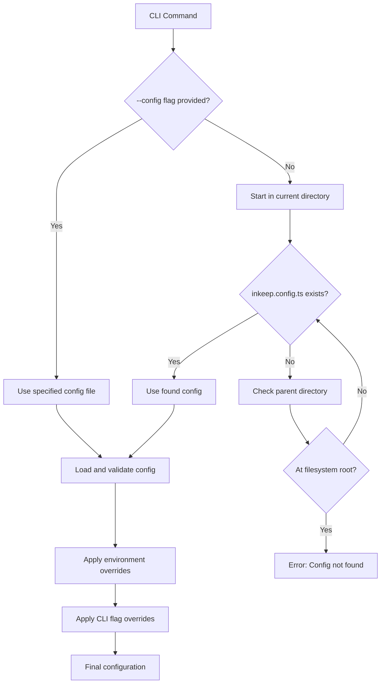
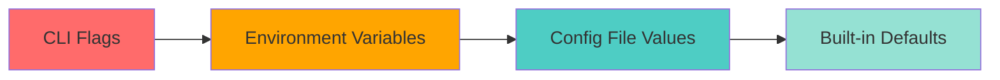

## Overview

Inkeep Agent projects use a hierarchical configuration system that combines file-based configuration, environment variables, and command-line overrides. This flexible approach supports different deployment environments while maintaining developer-friendly defaults.

## Configuration File Format

### `inkeep.config.ts`

The primary configuration file for your project:

```typescript
import { defineConfig } from '@inkeep/agents-cli/config';

export default defineConfig({
  // Required: Your tenant identifier
  tenantId: 'my-company',


  // API endpoints
  agentsManageApiUrl: 'http://localhost:3002',
  agentsRunApiUrl: 'http://localhost:3003',

  // Optional: Advanced settings
  apiTimeout: 30000,
  retryAttempts: 3,
});
```

### Configuration Options

| Option | Type | Description | Default |
|--------|------|-------------|---------|
| `tenantId` | `string` | **Required.** Unique identifier for your tenant | - |
| `agentsManageApiUrl` | `string` | Management API endpoint | `'http://localhost:3002'` |
| `agentsRunApiUrl` | `string` | Runtime API endpoint | `'http://localhost:3003'` |
| `apiTimeout` | `number` | API request timeout (ms) | `30000` |
| `retryAttempts` | `number` | Number of retry attempts | `3` |

## Config File Discovery

The CLI uses a sophisticated discovery mechanism to locate your configuration:



### Search Pattern

1. **Explicit Path**: If `--config` flag is provided, use that file directly
2. **Upward Search**: Starting from current working directory:
   - Look for `inkeep.config.ts` in current directory
   - If not found, move to parent directory
   - Repeat until found or reach filesystem root
   - Config file should be at the same level as `package.json`/`tsconfig.json`
3. **Error Handling**: If no config found, provide helpful error message

### Example Discovery

```bash
# Directory structure (workspace root)
/home/user/workspace/
├── package.json              # Workspace package.json
├── tsconfig.json             # Workspace TypeScript config
├── inkeep.config.ts          # ✅ Config file at workspace root
├── my-agents/                # Project directory
│   ├── index.ts              # Project entry point
│   └── subfolder/
│       └── current-location/ # CLI run from here
└── other-project/

# CLI searches: current-location → subfolder → my-agents → workspace → FOUND!
```

## Configuration Priority

Settings are resolved in this order (highest to lowest priority):



### 1. CLI Flags (Highest Priority)

Command-line flags override all other settings:

```bash
# Override API URL
inkeep push --agents-manage-api-url https://api.production.com

# Override config file location
inkeep pull --config /path/to/custom.config.ts

# Override environment
inkeep push --env production
```

### 2. Environment Variables

Environment variables override config file values:

```bash
# Set via environment
export INKEEP_AGENTS_MANAGE_API_URL=https://api.staging.com
export INKEEP_TENANT_ID=staging-tenant
export INKEEP_ENV=staging

# Now CLI commands use these values
inkeep push
```

**Supported Environment Variables:**

| Variable | Config Equivalent | Description |
|----------|-------------------|-------------|
| `INKEEP_TENANT_ID` | `tenantId` | Tenant identifier |
| `INKEEP_AGENTS_MANAGE_API_URL` | `agentsManageApiUrl` | Management API URL |
| `INKEEP_AGENTS_RUN_API_URL` | `agentsRunApiUrl` | Runtime API URL |
| `INKEEP_ENV` | - | Environment name for credential loading |
| `INKEEP_AGENTS_MANAGE_API_BYPASS_SECRET` | - | Optional API bypass token |
| `INKEEP_AGENTS_RUN_API_BYPASS_SECRET` | - | Optional API bypass token |

### 3. Config File Values

Values explicitly set in your `inkeep.config.ts`:

```typescript
export default defineConfig({
  tenantId: 'my-tenant',
  agentsManageApiUrl: 'http://localhost:3002',
  // These values used unless overridden
});
```

### 4. Built-in Defaults (Lowest Priority)

Default values used when not specified elsewhere:

```typescript
const defaults = {
  agentsManageApiUrl: 'http://localhost:3002',
  agentsRunApiUrl: 'http://localhost:3003',
  apiTimeout: 30000,
  retryAttempts: 3,
};
```

## Advanced Configuration

### TypeScript Support

The config system is fully typed, providing IntelliSense and validation:

```typescript
import { defineConfig, ConfigOptions } from '@inkeep/agents-cli/config';

// Get full type safety
const config: ConfigOptions = {
  tenantId: 'my-tenant', // ✓ Required
  invalidOption: true,   // ✗ TypeScript error
};

export default defineConfig(config);
```

### Dynamic Configuration

You can use environment-based logic in your workspace config:

```typescript
// inkeep.config.ts at workspace root
import { defineConfig } from '@inkeep/agents-cli/config';

const isDevelopment = process.env.NODE_ENV === 'development';

export default defineConfig({
  tenantId: process.env.TENANT_ID || 'default-tenant',
  agentsManageApiUrl: isDevelopment
    ? 'http://localhost:3002'
    : 'https://api.production.com',
  apiTimeout: isDevelopment ? 60000 : 30000,
});
```

**Note**: This single config file manages all projects within the workspace.

### Multiple Configurations

For workspaces requiring different configurations:

```typescript
// inkeep.config.ts (main config at workspace root)
export default defineConfig({
  tenantId: 'production-tenant',
  agentsManageApiUrl: 'https://api.production.com',
});
```

```typescript
// inkeep.dev.config.ts (development config at workspace root)
export default defineConfig({
  tenantId: 'dev-tenant',
  agentsManageApiUrl: 'http://localhost:3002',
});
```

```bash
# Use development config (specify from any project directory)
inkeep push --config ../inkeep.dev.config.ts
# or with absolute path
inkeep push --config /path/to/workspace/inkeep.dev.config.ts
```

## Configuration Validation

The CLI validates configuration at runtime:

### Required Fields

```typescript
export default defineConfig({
  // ✗ Error: tenantId is required
});
```

### URL Validation

```typescript
export default defineConfig({
  tenantId: 'my-tenant',
  agentsManageApiUrl: 'invalid-url', // ✗ Error: Invalid URL format
});
```

### Type Validation

```typescript
export default defineConfig({
  tenantId: 'my-tenant',
  apiTimeout: 'thirty seconds', // ✗ Error: Expected number
});
```

## Debugging Configuration

### View Current Configuration

```bash
# View all configuration values
inkeep config get

# View specific value
inkeep config get tenantId

# View with specific config file
inkeep config get --config ./custom.config.ts
```

### Configuration Sources

The CLI shows where each setting comes from:

```bash
inkeep config get tenantId
# Output: my-tenant (from environment variable)

inkeep config get agentsManageApiUrl
# Output: http://localhost:3002 (from config file)
```

## Best Practices

### 1. Environment-Specific Configs

Use different configs for different environments:

```bash
# Development
inkeep.config.ts          # Local development settings

# Staging
inkeep.staging.config.ts  # Staging environment settings

# Production
inkeep.prod.config.ts     # Production environment settings
```

### 2. Secret Management

Never commit secrets to config files:

```typescript
// ✗ Bad: Hardcoded secrets
export default defineConfig({
  tenantId: 'my-tenant',
  apiKey: 'sk-secret-key', // Don't do this!
});

// ✓ Good: Use environment variables
export default defineConfig({
  tenantId: 'my-tenant',
  // API keys handled via environment-specific credential configs
});
```

### 3. Documentation

Document your configuration options:

```typescript
export default defineConfig({
  // Production tenant for main application
  tenantId: 'acme-corp-prod',

  // Use staging API for development
  agentsManageApiUrl: process.env.NODE_ENV === 'development'
    ? 'https://api-staging.acme.com'
    : 'https://api.acme.com',

  // Longer timeout for large deployments
  apiTimeout: 60000,
});
```

## Troubleshooting

### Config Not Found

```bash
Error: Could not find inkeep.config.ts
```

**Solutions:**
- Ensure `inkeep.config.ts` exists at **workspace root** (same level as `package.json`)
- CLI searches upward - make sure you're running from within the workspace
- Use `--config` flag to specify absolute or relative path to config file
- Check file name (must be exactly `inkeep.config.ts`)
- Verify you're not running from a completely separate directory tree

### Invalid Configuration

```bash
Error: Invalid configuration: tenantId is required
```

**Solutions:**
- Add required `tenantId` field
- Check for typos in field names
- Verify TypeScript compilation

### Environment Issues

```bash
Warning: INKEEP_TENANT_ID environment variable overrides config
```

**Solutions:**
- Unset environment variable: `unset INKEEP_TENANT_ID`
- Use `--config` to override with specific file
- Check `.env` files for conflicting values

The configuration system provides the flexibility to adapt your Inkeep Agent projects to different environments while maintaining consistency and type safety across your development workflow.