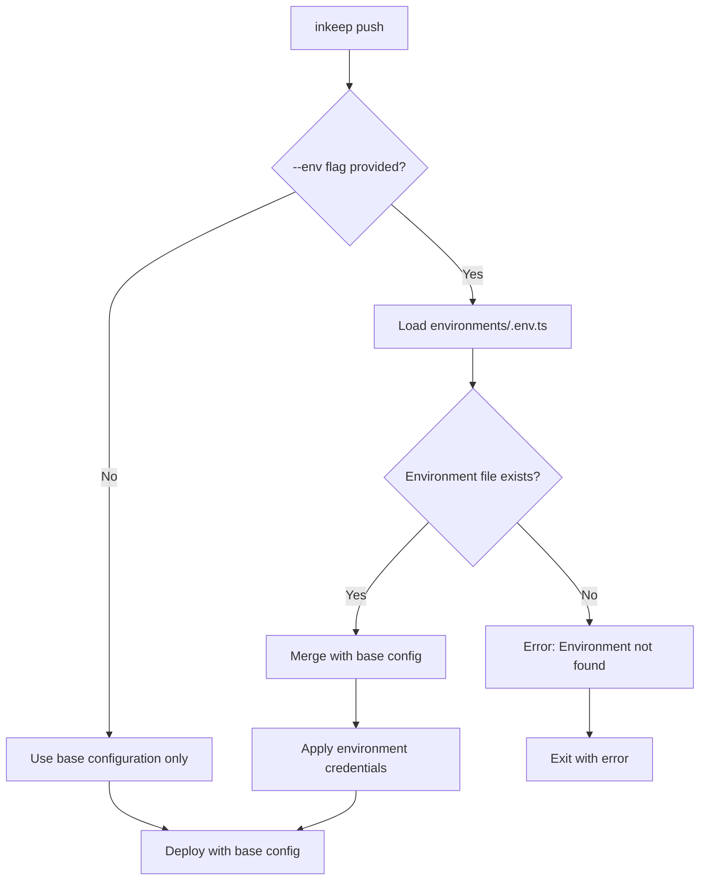

## Overview

Environment management in Inkeep Agent projects enables you to maintain different configurations for development, staging, and production deployments. The `--env` flag system provides secure credential management and environment-specific settings without duplicating your core project configuration.

## Environment Structure

### Directory Layout

```
workspace-root/
├── package.json              # Workspace package.json
├── inkeep.config.ts          # Base configuration (at workspace root)
└── my-project/               # Individual project directory
    ├── index.ts              # Project entry point
    ├── environments/         # Environment-specific configs
    │   ├── index.ts          # Environment exports
    │   ├── development.env.ts # Development settings
    │   ├── staging.env.ts    # Staging settings
    │   └── production.env.ts # Production settings
    └── ...
```

### Environment File Format

```typescript
// environments/development.env.ts
import { registerEnvironmentSettings } from '@inkeep/agents-sdk';
import { CredentialStoreType } from '@inkeep/agents-core';

export const development = registerEnvironmentSettings({
  credentials: {
    "openai-dev": {
      id: "openai-dev",
      type: CredentialStoreType.memory,
      credentialStoreId: "memory-default",
      retrievalParams: {
        key: "OPENAI_API_KEY_DEV",
      },
    },
    "anthropic-dev": {
      id: "anthropic-dev",
      type: CredentialStoreType.memory,
      credentialStoreId: "memory-default",
      retrievalParams: {
        key: "ANTHROPIC_API_KEY_DEV",
      },
    },
  },
});
```

## How Environments Work

### Environment Selection Flow



### Usage Examples

```bash
# Push with development environment
inkeep push --env development

# Push with production credentials
inkeep push --env production

# Push without environment (base config only)
inkeep push
```

## Environment Configuration

### Credential Management

Environments primarily manage credentials for different deployment stages:

```typescript
// environments/production.env.ts
import { registerEnvironmentSettings } from '@inkeep/agents-sdk';
import { CredentialStoreType } from '@inkeep/agents-core';

export const production = registerEnvironmentSettings({
  credentials: {
    // Production OpenAI credentials
    "openai-prod": {
      id: "openai-prod",
      type: CredentialStoreType.memory,
      credentialStoreId: "memory-default",
      retrievalParams: {
        key: "OPENAI_API_KEY_PROD",
      },
    },
    // Production database credentials
    "database-prod": {
      id: "database-prod",
      type: CredentialStoreType.memory,
      credentialStoreId: "memory-default",
      retrievalParams: {
        key: "DATABASE_URL_PROD",
      },
    },
    // External API credentials
    "external-api-prod": {
      id: "external-api-prod",
      type: CredentialStoreType.memory,
      credentialStoreId: "memory-default",
      retrievalParams: {
        key: "EXTERNAL_API_SECRET_PROD",
      },
    },
  },
});
```

### Environment Index File

Export all environments from the index file:

```typescript
// environments/index.ts
export { development } from './development.env';
export { staging } from './staging.env';
export { production } from './production.env';
```

## Credential Store Types

### Memory Store

Loads credentials from environment variables at runtime:

```typescript
{
  type: CredentialStoreType.memory,
  credentialStoreId: "memory-default",
  retrievalParams: {
    key: "API_KEY_ENV_VAR",
  },
}
```

### File Store

Loads credentials from secure files:

```typescript
{
  type: CredentialStoreType.file,
  credentialStoreId: "file-store",
  retrievalParams: {
    filePath: "/secure/path/to/credentials.json",
    key: "apiKey",
  },
}
```

### External Store

Integrates with external credential management systems:

```typescript
{
  type: CredentialStoreType.external,
  credentialStoreId: "vault-store",
  retrievalParams: {
    endpoint: "https://vault.company.com",
    path: "secret/api-keys",
  },
}
```

## Environment Workflows

### Development Environment

```typescript
// environments/development.env.ts
export const development = registerEnvironmentSettings({
  credentials: {
    "openai-dev": {
      id: "openai-dev",
      type: CredentialStoreType.memory,
      credentialStoreId: "memory-default",
      retrievalParams: {
        key: "OPENAI_API_KEY_DEV", // Uses dev API key
      },
    },
  },
});
```

```bash
# Set development environment variables
export OPENAI_API_KEY_DEV=sk-dev-key...
export ANTHROPIC_API_KEY_DEV=sk-ant-dev...

# Deploy to development
inkeep push --env development
```

### Staging Environment

```typescript
// environments/staging.env.ts
export const staging = registerEnvironmentSettings({
  credentials: {
    "openai-staging": {
      id: "openai-staging",
      type: CredentialStoreType.memory,
      credentialStoreId: "memory-default",
      retrievalParams: {
        key: "OPENAI_API_KEY_STAGING",
      },
    },
  },
});
```

### Production Environment

```typescript
// environments/production.env.ts
export const production = registerEnvironmentSettings({
  credentials: {
    "openai-prod": {
      id: "openai-prod",
      type: CredentialStoreType.memory,
      credentialStoreId: "memory-default",
      retrievalParams: {
        key: "OPENAI_API_KEY_PROD",
      },
    },
  },
});
```

## Advanced Environment Features

### Environment-Specific Overrides

While environments primarily manage credentials, they can include other settings:

```typescript
// environments/development.env.ts
export const development = registerEnvironmentSettings({
  // Credential configuration
  credentials: {
    // ... credential definitions
  },

  // Development-specific settings
  settings: {
    logLevel: 'debug',
    apiTimeout: 60000, // Longer timeout for debugging
  },
});
```

### Conditional Environments

Create environments that adapt to runtime conditions:

```typescript
// environments/dynamic.env.ts
const isDevelopment = process.env.NODE_ENV === 'development';

export const dynamic = registerEnvironmentSettings({
  credentials: {
    "api-key": {
      id: "api-key",
      type: CredentialStoreType.memory,
      credentialStoreId: "memory-default",
      retrievalParams: {
        key: isDevelopment ? "API_KEY_DEV" : "API_KEY_PROD",
      },
    },
  },
});
```

## Environment Variables Integration

### CLI Environment Variables

The CLI respects these environment variables when using the `--env` flag:

```bash
# Set environment name via environment variable
export INKEEP_ENV=production
inkeep push  # Uses production environment automatically

# Override via CLI (takes precedence)
inkeep push --env development  # Uses development instead
```

### Credential Environment Variables

Environment files reference environment variables for actual credential values:

```bash
# Development
export OPENAI_API_KEY_DEV=sk-dev-...
export DATABASE_URL_DEV=postgresql://dev...

# Production
export OPENAI_API_KEY_PROD=sk-prod-...
export DATABASE_URL_PROD=postgresql://prod...
```

## Best Practices

### 1. Credential Isolation

Keep credentials completely separate between environments:

```typescript
// ✓ Good: Environment-specific credential IDs
const development = registerEnvironmentSettings({
  credentials: {
    "openai-dev": { /* dev credentials */ },
    "database-dev": { /* dev database */ },
  },
});

const production = registerEnvironmentSettings({
  credentials: {
    "openai-prod": { /* prod credentials */ },
    "database-prod": { /* prod database */ },
  },
});
```

### 2. Secure Secret Management

Never commit secrets to environment files:

```typescript
// ✗ Bad: Hardcoded secrets
export const production = registerEnvironmentSettings({
  credentials: {
    "api-key": {
      value: "sk-secret-key", // Don't do this!
    },
  },
});

// ✓ Good: Reference environment variables
export const production = registerEnvironmentSettings({
  credentials: {
    "api-key": {
      type: CredentialStoreType.memory,
      retrievalParams: {
        key: "API_KEY_PROD", // Loaded from environment
      },
    },
  },
});
```

### 3. Environment Naming

Use consistent, descriptive environment names:

```bash
# ✓ Good: Clear, standard names
environments/
├── development.env.ts
├── staging.env.ts
└── production.env.ts

# ✗ Avoid: Ambiguous names
environments/
├── dev.env.ts      # Too abbreviated
├── test.env.ts     # Confusing (test vs staging?)
└── live.env.ts     # Unclear (live vs production?)
```

### 4. Environment Documentation

Document what each environment is for:

```typescript
/**
 * Development environment configuration
 * - Uses development API keys
 * - Connects to local development services
 * - Enables debug logging
 */
export const development = registerEnvironmentSettings({
  credentials: {
    // Development-specific credentials...
  },
});
```

## Troubleshooting

### Environment Not Found

```bash
Error: Environment file 'environments/staging.env.ts' not found
```

**Solutions:**
- Check file exists in `/environments/` directory
- Verify file name matches `--env` parameter exactly
- Ensure file exports environment with correct name

### Credential Loading Issues

```bash
Error: Environment variable 'OPENAI_API_KEY_PROD' not set
```

**Solutions:**
- Set required environment variables before push
- Check environment variable names in credential config
- Verify credential store configuration

### Environment Override Issues

```bash
Warning: No credentials found for environment 'production'
```

**Solutions:**
- Check environment file exports credentials object
- Verify credential IDs match agent requirements
- Test environment file syntax with TypeScript compiler

## CI/CD Integration

### GitHub Actions

```yaml
# .github/workflows/deploy.yml
name: Deploy Agents

on:
  push:
    branches: [main]

jobs:
  deploy-staging:
    runs-on: ubuntu-latest
    steps:
      - uses: actions/checkout@v3
      - name: Setup Node.js
        uses: actions/setup-node@v3
      - name: Install CLI
        run: npm install -g @inkeep/agents-cli
      - name: Deploy to Staging
        env:
          OPENAI_API_KEY_STAGING: ${{ secrets.OPENAI_API_KEY_STAGING }}
          ANTHROPIC_API_KEY_STAGING: ${{ secrets.ANTHROPIC_API_KEY_STAGING }}
        run: inkeep push --env staging

  deploy-production:
    runs-on: ubuntu-latest
    needs: deploy-staging
    if: github.ref == 'refs/heads/main'
    steps:
      - uses: actions/checkout@v3
      - name: Deploy to Production
        env:
          OPENAI_API_KEY_PROD: ${{ secrets.OPENAI_API_KEY_PROD }}
          ANTHROPIC_API_KEY_PROD: ${{ secrets.ANTHROPIC_API_KEY_PROD }}
        run: inkeep push --env production
```

### Docker Integration

```dockerfile
# Dockerfile
FROM node:18

# Install CLI
RUN npm install -g @inkeep/agents-cli

# Copy project
COPY . /app
WORKDIR /app

# Set environment and deploy
ARG ENVIRONMENT=production
ENV INKEEP_ENV=${ENVIRONMENT}

CMD ["inkeep", "push"]
```

Environment management provides the foundation for secure, scalable deployment of your Inkeep Agent projects across different stages of your development lifecycle.