## Overview

The `inkeep push` and `inkeep pull` commands implement sophisticated workflows for deploying and synchronizing agent projects. These workflows handle project discovery, configuration resolution, resource compilation, and bidirectional synchronization between local and remote environments.

## Push Workflow

The push workflow deploys your local project to the Inkeep management API:


### Push Process Details

1. **Argument Parsing**: CLI parses command-line arguments and flags
2. **Configuration Resolution**: Loads and merges configuration from multiple sources
3. **Environment Application**: Applies environment-specific settings if specified
4. **Project Discovery**: Scans project directory for resources
5. **Resource Compilation**: Compiles TypeScript files and resolves dependencies
6. **Validation**: Validates resource configurations and relationships
7. **Deployment**: Uploads resources to management API
8. **Confirmation**: Returns deployment summary

### Configuration Resolution Flow


## Pull Workflow

The pull workflow synchronizes local files with remote configurations:


### Pull Process Details

1. **Configuration Resolution**: Same as push workflow
2. **API Connection**: Connects to management API
3. **Data Fetching**: Retrieves complete project data from server
4. **File Discovery**: Scans local project for TypeScript files
5. **File Categorization**: Identifies file types for context-aware processing
6. **LLM Generation**: Uses AI to update files with server data
7. **Validation**: Validates generated TypeScript syntax
8. **File Updates**: Writes updated content to local files

### File Categorization Logic


## Resource Processing Flow

Both push and pull operations process project resources systematically:

```mermaid
graph TD
    A[Workspace Root] --> A1[Find inkeep.config.ts]
    A1 --> B[Discover Project Directories]
    B --> B1[Look for subdirs with index.ts]
    B1 --> C[Scan Project Files]
    C --> D[Exclude patterns]

    D --> E{File location}
    E -->|/node_modules/| F[Skip]
    E -->|/.git/| F
    E -->|project/environments/| G[Environment Config]
    E -->|project/*.ts files| H[Project Resource]

    H --> I[Parse TypeScript]
    I --> J[Extract exports]
    J --> K{Export type}

    K -->|project call| L[Project Definition]
    K -->|agentGraph call| M[Graph Definition]
    K -->|agent call| N[Agent Definition]
    K -->|tool call| O[Tool Definition]
    K -->|dataComponent call| P[Data Component]
    K -->|Other| Q[Generic Resource]

    L --> R[Compile Resources per Project]
    M --> R
    N --> R
    O --> R
    P --> R
    G --> S[Load Environment per Project]

    R --> T[Validate Dependencies]
    T --> U[Build Resource Graph]
    U --> V[Ready for Push/Pull]

    style F fill:#ffcdd2
    style G fill:#fff9c4
    style R fill:#c8e6c9
    style V fill:#c8e6c9

    %% Structure note
    W["📁 Workspace Structure:<br/>config.ts at root<br/>projects in subdirs"]
    style W fill:#fff3e0
```



## Error Handling and Recovery

Both workflows include comprehensive error handling:


## Performance Optimizations

The workflows include several performance optimizations:

### Parallel Processing


### Caching Strategy


## Best Practices

### 1. Pre-Push Validation

Always validate your project before pushing:

```bash
# Validate without pushing
inkeep push --json

# Check for TypeScript errors
npx tsc --noEmit

# Run tests
npm test
```

### 2. Environment-Specific Deployments

Use environments for different deployment stages:

```bash
# Development deployment
inkeep push --env development

# Staging deployment
inkeep push --env staging

# Production deployment (with validation)
inkeep push --json && inkeep push --env production
```

### 3. Pull with Backup

Always backup before pulling changes:

```bash
# Create backup branch
git checkout -b backup-before-pull

# Pull changes
inkeep pull

# Review changes
git diff

# Commit or revert as needed
```

### 4. Monitoring Deployments

Use logging and monitoring during deployments:

```bash
# Enable debug logging
DEBUG=1 inkeep push --env production

# Monitor deployment
inkeep list-graphs
```

These workflows provide a robust foundation for managing your Inkeep Agent projects across different environments and deployment scenarios. The visual diagrams help understand the complex interactions between configuration resolution, resource processing, and API communication that make the CLI both powerful and reliable.